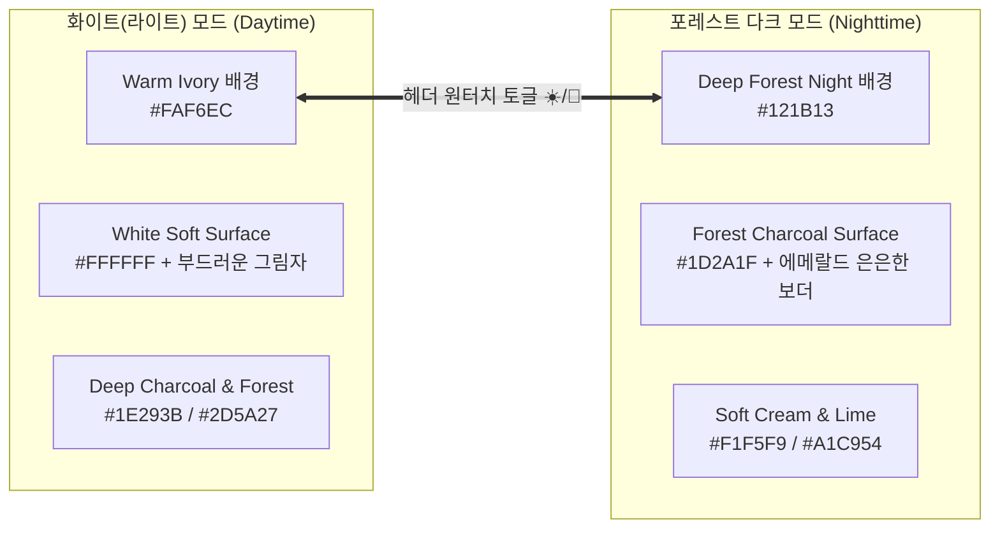

# [디자인 가이드라인] 보카하이(vocahigh) 교육용 디자인 설계서 (design.md)

> **"학생들의 눈이 편안하고, 매일 켜고 싶은 따뜻하고 직관적인 단어 텃밭"**  
> 본 문서는 보카하이(vocahigh) 웹 애플리케이션의 시각적 디자인, UI/UX 구조, 컬러 토큰, 다크/화이트 모드 테마, 컴포넌트 스타일 규격을 총망라한 **공식 디자인 명세서**입니다.

---

## 1. 디자인 철학 및 기본 원칙 (Core Design Philosophy)

### 🌿 1.1 친근하고 둥글둥글한 교육 감성 (Friendly & Soft Rounded)
- **대상 사용자**: 초/중/고 학생 및 영단어를 쉽게 정복하고 싶은 모든 학습자(교육자 친화적 인터페이스).
- **형태적 특징**: 
  - 딱딱하고 각진 모서리를 완전히 배제합니다.
  - 모든 카드, 컨테이너, 버튼은 **`rounded-2xl(16px)` ~ `rounded-3xl(24px)`**, 또는 완전한 알약 형태인 **`rounded-full(Pill shape)`**을 사용합니다.
  - 모바일 터치에 최적화된 큰 터치 영역(최소 높이 48px~56px)과 부드러운 눌림 효과(`active:scale-95 transition-all`)를 적용합니다.

### 🎯 1.2 직관적인 정보 위계 (Ultra Intuitive)
- 기술적이고 복잡한 개발자 용어(예: "24가지 알고리즘 조합")를 완전 추방합니다.
- 학생이 화면을 켰을 때 **"지금 내가 무엇을 해야 하는가?"**를 3초 안에 알 수 있도록, 핵심 액션 카드(`오늘의 학습목표`, `장기기억 SAVE`)를 가장 눈에 띄게 배치합니다.
- 직관적인 아이콘과 게이미피케이션(☀️ 햇살 적립 ➔ 🌳 자라나는 **보카 트리**)을 통해 성취감을 제공합니다.

### 💡 1.3 용어 개편: 4지선다 ➔ '워드 리콜 (Word Recall)'
- 단순 시험 느낌의 차가운 '4지선다 퀴즈' 대신, 뇌과학적 기억 인출 훈련을 상징하는 **'워드 리콜 (Word Recall)'**로 공식 명칭을 변경합니다.
- 문제를 읽고 머릿속에서 단어와 의미를 즉각 회상(Recall)할 수 있도록 깔끔하고 큼직한 4개 선택지 카드 버튼으로 설계합니다.

---

## 2. 컬러 시스템 (Color Palette System)

`design_guide/color_pallet.png`의 5가지 자연 모티브 색상을 기반으로, **집중력 향상**과 **시각적 피로 완화**에 최적화된 색채를 도출하였습니다.

```
[Forest Green]   [Sage Green]     [Lime Sprout]    [Warm Ivory]     [Brick Coral]
   #2D5A27          #5F8D4E          #A1C954          #FAF6EC          #C24A4A
  (주요 강조/헤더)   (보조/안정 버튼)   (새싹 포인트/달성) (배경/카드 바탕)   (오답/알림/경고)
```

### 🎨 2.1 색상 팔레트 상세 규격

| 역할 | 명칭 | HEX 코드 | Tailwind 추천 클래스 | 용도 및 의미 |
| :--- | :--- | :--- | :--- | :--- |
| **Primary** | Deep Forest Green | `#2D5A27` | `bg-[#2D5A27]`, `text-[#2D5A27]` | 헤더 타이틀, 주요 CTA 버튼, 레벨 엠블럼 |
| **Secondary** | Sage Foliage | `#5F8D4E` | `bg-[#5F8D4E]`, `text-[#5F8D4E]` | 진행률 게이지, 보조 카드 배경, 서브 버튼 |
| **Accent / Point** | Lime Sprout | `#A1C954` | `bg-[#A1C954]`, `text-[#88B042]` | 완료 도장(Stamp), 정답 강조, 보카 트리 새싹 |
| **Surface / Light Base** | Warm Ivory / Cream | `#FAF6EC` | `bg-[#FAF6EC]`, `border-[#EADBCA]` | 라이트모드 기본 배경, 눈부심 방지 온화한 종이 질감 |
| **Warning / Alert** | Brick Coral / Terracotta | `#C24A4A` | `bg-[#C24A4A]`, `text-[#C24A4A]` | 복습 누적 경고, 오답 표시, 삭제/취소 버튼 |

---

## 3. 다크모드 & 화이트모드 (Dark / Light Mode) 완벽 규격

학생들이 낮에는 햇빛 아래에서도 선명한 **화이트(웜 아이보리) 모드**를, 밤에는 잠들기 전 침대에서도 눈이 편안한 **포레스트 다크 모드**를 즐길 수 있도록 완벽한 대비비를 갖춘 토큰을 설계합니다.



### 🌓 3.1 모드별 스타일 토큰 매핑 테이블

| UI 요소 | 라이트 모드 (White/Cream Mode) | 다크 모드 (Forest Dark Mode) | 비고 |
| :--- | :--- | :--- | :--- |
| **앱 전체 배경** | `#FAF6EC` (따뜻한 미색 아이보리) | `#121B13` (아주 짙은 심야 숲색) | 눈부심 및 블루라이트 방지 |
| **모바일 프레임 테두리** | `#E5DEC9` (은은한 크림 베이지) | `#2A3A2C` (차분한 다크 올리브) | 데스크톱 중앙 뷰포트 경계 |
| **카드 / 팝업 배경** | `#FFFFFF` (순백색 + 은은한 그림자) | `#1D2A1F` (은은한 포레스트 서피스) | `rounded-2xl` 기본 적용 |
| **카드 테두리(Border)** | `#F0E9D7` (부드러운 구분선) | `#2E4232` (세련된 음영선) | 1px 경계선으로 구조 명확화 |
| **기본 본문 텍스트** | `#2C3E2D` (자연스러운 다크 그린그레이) | `#EDECE4` (따뜻하고 선명한 오프화이트) | WCAG AAA 가독성 기준 만족 |
| **보조 설명 텍스트** | `#6B7F6D` (차분한 미디엄 세이지) | `#9DB3A0` (연한 세이지 그레이) | 발음기호, 부가설명 등 |
| **주요 버튼(CTA)** | `bg-[#2D5A27]` (포레스트) + 흰색 글씨 | `bg-[#5F8D4E]` 또는 `bg-[#A1C954]` + 진한 텍스트 | 명확한 시각적 유도 |
| **선택지 카드(미선택)** | `bg-[#F5F1E4]` / Hover시 `#EDE7D3` | `bg-[#243427]` / Hover시 `#2E4232` | 둥근 라운드 카드 |
| **선택지 카드(정답/선택)**| `bg-[#E8F3D6] border-[#5F8D4E]` | `bg-[#28442D] border-[#A1C954]` | 밝은 연두 하이라이트 |
| **하단 네비게이션 바** | `#FFFFFF` (반투명 블러 백드롭) | `#162217` (반투명 블러 백드롭) | 고정 하단 탭 바 |

---

## 4. 모바일 퍼스트 레이아웃 & 네비게이션 구조

### 📱 4.1 뷰포트 규격
- **스마트폰 전용 중앙 뷰포트**: 
  - 데스크톱 모니터에서도 스마트폰 앱을 쥐고 있는 듯한 몰입감을 주기 위해 최대 너비 **`max-w-[430px]`**로 중앙 정렬합니다.
  - 외곽 배경은 테마에 따라 은은한 그라데이션 블러 효과가 들어간 캔버스로 처리합니다.
  - 앱 컨테이너 높이는 스마트폰 스크린 비율인 **`min-h-[860px]`** 및 모바일 풀 스크린(`h-screen`)에 유연하게 대응합니다.

### 🧭 4.2 상단 헤더 & 좌측 사이드 메뉴 (Drawer)
`design_guide/좌측 팝업.png`에 명시된 레이아웃을 정확하게 구현합니다:
1. **상단 앱 바 (Header Bar)**:
   - 좌측: 햄버거 메뉴 버튼 (`☰`) ➔ 클릭 시 좌측 드로어 팝업 오픈
   - 중앙: 웹 이름 로고 **`vocahigh 보카하이 🌱`**
   - 우측: 다크/화이트 모드 토글 아이콘 (`☀️ / 🌙`) + 내 햇살 카운터(☀️ 120)

2. **좌측 슬라이드 팝업 메뉴 (`좌측 팝업.png` 확장 반영)**:
   - **[내 정보] 섹션**:
     - 🏃 **이어 학습하기**: 중단했던 학습으로 즉시 점프
     - 📊 **학습 현황**: 일일 연속 출석일수, 외운 총 단어 수 통계
     - 🏆 **학습 랭킹**: 친구들과 함께하는 단어 마스터 순위
     - 🌳 **보카 트리 (Voca Tree)**: 단어당 햇살 1개로 자라는 나의 나무
   - **[단어장] 섹션**:
     - 📚 **커리큘럼 설정 / 변경**: 단어장, 목표량, 출석 인정 기준 체크박스 확인
   - **[도움말] 섹션**:
     - 💡 **기능 설명**: 에빙하우스 망각곡선 주기 원리
     - 🎓 **기능 튜토리얼 (Interactive Sandbox)**: 스포트라이트 직접 체험 가이드

---

## 5. 화면별 상세 시각 디자인 명세

### 📋 5.1 커리큘럼 생성: 출석 체크 인정 기준 체크박스 UI
커리큘럼 생성 모달 내에 배치되는 둥글고 직관적인 4종 선택 카드 컴포넌트입니다:

```
[ 출석 인정 기준 설정 ]
"오늘 어떤 학습/훈련을 완료해야 출석 도장을 받을까요? (다중 선택 가능)"

+-------------------------------------------------------------+
|  [✓] 📖 학습 단어장                                         |
|      기본 단어 카드로 뜻과 예문을 꼼꼼히 확인합니다.          |
+-------------------------------------------------------------+
|  [✓] 🃏 플래시카드                                          |
|      앞뒤를 뒤집으며 머릿속 기억을 가볍게 점검합니다.       |
+-------------------------------------------------------------+
|  [✓] 🧠 워드리콜 (Word Recall)                              |
|      4개 보기 중 올바른 뜻/단어를 빠르게 인출합니다.        |
+-------------------------------------------------------------+
|  [ ] ✍️ 스펠링 훈련                                         |
|      가상 키보드로 철자를 한 글자씩 직접 입력합니다.        |
+-------------------------------------------------------------+
```
- **인터랙션 디자인**:
  - 미선택 시: `bg-white dark:bg-[#1D2A1F] border border-[#EADBCA]`
  - 선택 시: `bg-[#F1F8E9] dark:bg-[#203624] border-2 border-[#5F8D4E] dark:border-[#A1C954]` 로 부드러운 초록 테두리와 체크마크(✓) 점등.
  - 손가락으로 누를 때 알약 크기의 토글 체크박스가 통통 튀는 탄성 애니메이션(`scale-105`) 적용.

---

### 🌳 5.2 보카 트리 (Voca Tree) 화면 디자인 명세
학습자가 단어를 정복할 때마다 햇살을 모아 나무를 성장시키는 시각적 게이미피케이션 공간입니다.

```
+-------------------------------------------------------------+
|  ←  보카 트리 (Voca Tree)                           ☀️ 320   |
+-------------------------------------------------------------+
|                                                             |
|                   [ Lv.3 어린 줄기 🎋 ]                      |
|                   "싱그럽게 잎을 틔우고 있어요!"            |
|                                                             |
|                          🎋                                 |
|                       /  |  \                               |
|                     🌿   🌱   🌿                            |
|                    ━━━━━━━━━━━━                             |
|                                                             |
|  햇살 게이지: 320 / 500 ☀️ (다음 레벨: 푸른 묘목 🪴)        |
|  [████████████░░░░░░░░░░░░] 64%                             |
|                                                             |
|  +-------------------------------------------------------+  |
|  | 💡 햇살 획득 비결                                      |  |
|  | • 단어 1개 학습 또는 복습 완료 = 무조건 햇살 1 ☀️      |  |
|  | • 매일매일 꾸준히 단어를 만나면 황금 나무로 자라나요!  |  |
|  +-------------------------------------------------------+  |
+-------------------------------------------------------------+
```

#### 🌿 7단계 성장 비주얼 & 햇살 구간
| 레벨 | 성장 단계명 | 요구 햇살 | 대표 비주얼 | 그래픽 및 시각 효과 |
| :--- | :--- | :--- | :---: | :--- |
| **Lv.1** | **씨앗 (Seed)** | 0 ~ 99 | 🌱 | 따뜻한 흙 위에 콕 박힌 단단한 황금 씨앗 |
| **Lv.2** | **새싹 (Sprout)** | 100 ~ 299 | 🌿 | 고개를 쏙 내민 귀여운 두 잎 연두색 아기 새싹 |
| **Lv.3** | **어린 줄기 (Stem)** | 300 ~ 499 | 🎋 | 쑥쑥 뻗어오르는 줄기와 잎새, 은은한 바람 효과 |
| **Lv.4** | **푸른 묘목 (Sapling)**| 500 ~ 999 | 🪴 | 도톰한 나무 기둥과 풍성한 초록 잎을 지닌 묘목 |
| **Lv.5** | **보카 나무 (Voca Tree)**| 1,000 ~ 1,999 | 🌳 | 넓은 그늘과 싱그러운 나뭇잎이 가득한 거대 나무 |
| **Lv.6** | **황금 지혜나무** | 2,000 ~ 4,999 | 🌟 | 반짝이는 황금빛 열매와 꽃이 만개한 마법의 지혜나무 |
| **Lv.7** | **불멸의 세계수** | 5,000+ | 👑 | 영롱한 무지갯빛 오라를 뿜어내는 단어의 수호 세계수 |

- **햇살 적립 피드백**:
  - 단어 1개 통과 시 상단 우측으로 작은 햇살 아이콘(`☀️ +1`)이 둥실 떠오르며 카운터로 빨려 들어가는 플로팅 파티클 애니메이션 구현.

---

### 🎓 5.3 인터랙티브 기능 튜토리얼: 스포트라이트 오버레이 명세
초보자가 겁먹지 않고 핵심 3대 기능(커리큘럼 생성 ➔ 단어 학습 ➔ 출석 도장)을 손으로 직접 익히는 가이드 투어 모드입니다.

```
+-------------------------------------------------------------+
| // [검정 반투명 오버레이 bg-black/75 로 전체 화면 차단]      |
|                                                             |
|             +---------------------------------+             |
|             | 💬 [튜토리얼 가이드 말풍선]       |             |
|             | "먼저 단어장을 선택해 볼까요?   |             |
|             |  아래 버튼을 톡 눌러주세요!"    |             |
|             +---------------------------------+             |
|                              ▼                              |
|       +---------------------------------------------+       |
|  ==>  | ⭐ [스포트라이트 타깃 버튼] (Z-Index 50)     |  <== |
|       |  [ 중학 필수 영단어 800 선택하기 ]           |       |
|       +---------------------------------------------+       |
|       (연두색 펄스 테두리 번쩍임 + 다른 모든 영역 클릭 불가) |
|                                                             |
| // [안내 배지]: 🛡️ 튜토리얼 모드 (기록은 저장되지 않아요)    |
+-------------------------------------------------------------+
```

1. **스포트라이트 마스킹 메커니즘**:
   - 화면 전체를 `fixed inset-0 bg-black/75 z-40 transition-opacity`로 덮어 주변 요소를 완전히 어둡게 처리.
   - 현재 가이드 중인 해당 타깃 요소만 `relative z-50 ring-4 ring-[#A1C954] ring-offset-4 ring-offset-black animate-pulse` 효과를 적용하여 눈부시게 강조.
   - 타깃 버튼 외의 영역은 클릭/터치 이벤트가 완전히 차단되어 유저가 딴 길로 새지 않음.
2. **샌드박스 보장 정책**:
   - 상단에 `[🛡️ 체험 튜토리얼 진행 중 - 계정에 저장되지 않음]` 배지를 고정 표시.
   - 튜토리얼 완료 시 "축하합니다! 이제 진짜 단어 공부를 시작해 볼까요?" 팝업과 함께 정규 메인 홈으로 자연스럽게 복귀.

---

### 🧠 5.4 훈련 모드: '워드 리콜 (Word Recall)' 인터페이스
기존 '4지선다'를 완전히 새롭게 리브랜딩한 메인 훈련 인터페이스입니다:

```
+------------------------------------------+
|  ←  워드 리콜 (Word Recall)     3/20  ⏱️8s|
+------------------------------------------+
|                                          |
|             단어 인출 퀴즈               |
|                                          |
|           [  remarkable  ]               |
|              /rɪˈmɑːrkəbl/               |
|               🔊 발음 듣기               |
|                                          |
|  +------------------------------------+  |
|  | 1. 평범한, 흔한                    |  |
|  +------------------------------------+  |
|  | 2. 놀랄 만한, 주목할 만한    ✅    |  |  <-- 정답 선택 시 연두색 펄스
|  +------------------------------------+  |
|  | 3. 실망스러운, 우울한              |  |
|  +------------------------------------+  |
|  | 4. 긴급한, 다급한                  |  |
|  +------------------------------------+  |
|                                          |
|  [ 💡 힌트 보기 ]     [ ⏭️ 다음 단어로 ]  |
+------------------------------------------+
```

- **카드 인터랙션**:
  - 선택지 버튼은 도톰한 패딩(`py-4 px-5`)과 큰 글씨체, `rounded-2xl` 적용.
  - 손가락 터치 시 햅틱 효과를 연상시키는 부드러운 눌림 애니메이션.
  - 정답 선택 시 기분 좋은 연두색 테두리와 '딩동댕' 피드백 배지 + 상단 `☀️ +1` 햇살 획득 효과.
  - 오답 선택 시 부드러운 코랄 레드 흔들림(`shake`) 효과 및 정답을 바로 보여주는 친절한 피드백.

---

## 6. 컴포넌트 스타일 규격 가이드 (Tailwind CSS 기준)

초보 개발자/교육자도 즉시 복사하여 사용할 수 있는 UI 컴포넌트 표준 클래스 가이드입니다:

### 🔘 6.1 둥근 버튼 (Rounded Button)
```html
<!-- 기본 주요 버튼 (Primary CTA) -->
<button class="w-full py-4 px-6 bg-[#2D5A27] hover:bg-[#23471F] text-white font-bold text-base rounded-2xl shadow-md hover:shadow-lg active:scale-95 transition-all flex items-center justify-center gap-2">
  <span>⚡</span>
  <span>오늘의 단어 학습 시작하기</span>
</button>

<!-- 훈련 선택 카드 버튼 (워드 리콜 선택지) -->
<button class="w-full py-4 px-5 bg-white dark:bg-[#1D2A1F] border-2 border-[#EADBCA] dark:border-[#2E4232] hover:border-[#5F8D4E] text-[#2C3E2D] dark:text-[#EDECE4] font-medium text-left rounded-2xl shadow-sm hover:shadow active:scale-98 transition-all">
  <span class="inline-block w-7 h-7 rounded-full bg-[#FAF6EC] dark:bg-[#28442D] text-center leading-7 text-sm font-bold text-[#2D5A27] dark:text-[#A1C954] mr-2">1</span>
  놀랄 만한, 주목할 만한
</button>
```

### 📦 6.2 둥근 출석 기준 체크박스 카드 (Rounded Checkbox Card)
```html
<label class="flex items-center gap-3.5 p-4 rounded-2xl border-2 transition-all cursor-pointer bg-white dark:bg-[#1D2A1F] border-[#EADBCA] dark:border-[#2E4232] hover:border-[#5F8D4E]">
  <input type="checkbox" class="w-5 h-5 rounded-lg text-[#2D5A27] focus:ring-[#A1C954] border-gray-300" />
  <div class="flex-1">
    <div class="font-bold text-sm text-[#2C3E2D] dark:text-[#EDECE4]">🧠 워드리콜 (Word Recall)</div>
    <div class="text-xs text-[#6B7F6D] dark:text-[#9DB3A0]">4지선다 객관식 기억 인출 훈련</div>
  </div>
</label>
```

---

## 7. 구현 반영 체크리스트 (Implementation Checklist)

- [x] `design_guide/color_pallet.png` 기반의 5색 컬러 팔레트 구축 완료
- [x] 부드럽고 둥글둥글한 라운드(`rounded-2xl`, `rounded-3xl`, `rounded-full`) 일괄 적용
- [x] 눈이 편안한 라이트(웜 크림) / 다크(포레스트 나이트) 모드 듀얼 테마 설계
- [x] '4지선다' ➔ **'워드 리콜 (Word Recall)'** 명칭 개편 및 인터랙션 설계
- [x] **출석 체크 인정 기준 커스텀 체크박스** (학습단어장, 플래시카드, 워드리콜, 스펠링) UI 설계
- [x] **보카 트리 (Voca Tree)** 7단계 성장(씨앗~세계수) 및 단어당 햇살 1개(☀️+1) 적립 시스템 명세
- [x] **인터랙티브 기능 튜토리얼**: 검정 반투명 오버레이 및 스포트라이트 타깃 제한 UI 규격
- [x] `design_guide/좌측 팝업.png`의 사이드 드로어 메뉴(내 정보, 단어장, 기능설명, 보카 트리) 반영
