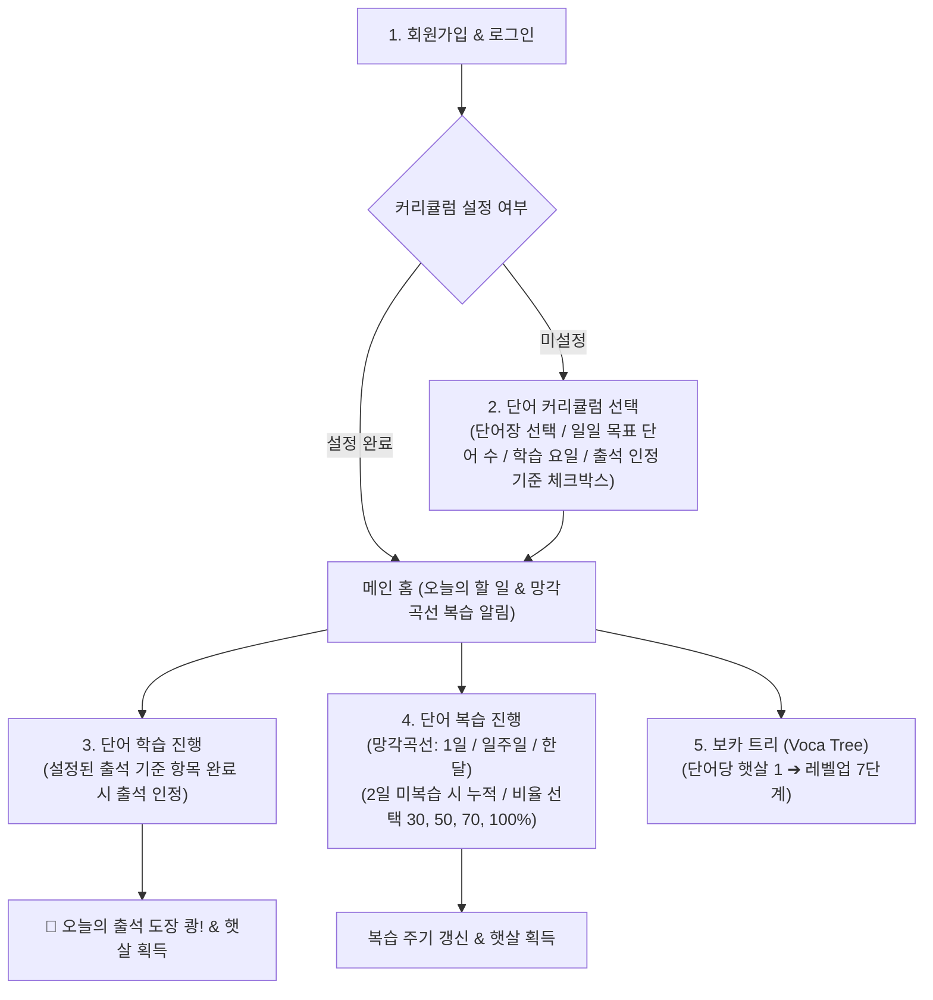

# [전면 개편 기획안] 보카하이(vocahigh) 모바일 퍼스트 단어 암기 시스템

사용자님의 명확한 지적과 요구사항을 바탕으로, 전체 애플리케이션의 프로세스와 UI/UX를 **모바일 퍼스트(Mobile-First)** 환경에 맞추어 처음부터 완전히 재설계합니다.

---

## 1. 핵심 사용자 이용 프로세스 (User Flow)

> [!IMPORTANT]
> **커리큘럼 미선택 시 학습/훈련 접근 차단**:
> 로그인 후 커리큘럼(단어장, 일일 목표량, 요일, 출석 인정 기준)을 설정하지 않으면 학습 및 훈련 화면으로 진입할 수 없으며, 반드시 커리큘럼 설정 화면으로 먼저 유도됩니다.

---

## 2. 단계별 상세 기능 명세

### 1단계: 회원가입 & 로그인 (User Auth)
- **모바일 로그인 화면**:
  - 간편 이메일/비밀번호 로그인 및 회원가입
  - 비밀번호 안전 해싱 암호화 및 자동 로그인(세션 유지) 지원
  - 학생 개인별 학습 데이터(커리큘럼, 복습 주기, 완료 기록, 트리 레벨) 격리 보장

---

### 2단계: 다중 커리큘럼 관리 & 홈 화면 연동 (Multi-Curriculum System)
> **커리큘럼을 여러 개 생성하여 관리할 수 있으며, 활성화된 커리큘럼이 있어야만 홈 화면의 일일 학습 및 훈련 기능이 작동합니다.**

1. **사이드바 [단어장] 하위 메뉴 개편**:
   - `⚙️ 커리큘럼 생성`: 교재 선택, 하루 학습 단어 수(20/30/40/50개), 학습 요일, 출석 인정 기준을 설정하여 새로운 커리큘럼 생성.
   - `📋 나의 커리큘럼`: 내가 생성한 커리큘럼 목록을 확인하고, 현재 공부할 커리큘럼을 선택(활성화)하거나 삭제.
2. **메인 홈 화면 조건부 노출 & 커리큘럼 선택**:
   - **미설정 시**: 커리큘럼이 없으면 "시작하려면 먼저 커리큘럼을 생성해 주세요" 안내 카드 및 `[ ➕ 커리큘럼 생성하기 ]` 버튼으로 유도.
   - **설정 시**: 메인 홈 화면 상단에 **'커리큘럼 선택'** 드롭다운/셀렉터를 제공하여 생성해 둔 커리큘럼 간 즉시 전환 가능.
   - *(기존의 '단어장 변경' 버튼 및 화면 하단 탭 바는 완전 삭제)*

---

### 3단계: 단어 학습 & 훈련 파이프라인 (Daily Study & Training Pipeline)

1. **<학습 단어장 진입 옵션 팝업>**:
   - **암기 스타일 3종 선택**:
     - `📘 기본 (단어 + 뜻)`: 영어 스펠링과 한글 뜻, 예문이 함께 보이는 기본 종합 학습.
     - `🃏 단어 & 뜻 보기 (뜻 가림 뒤집기)`: 왼쪽에는 영단어 스펠링 카드, 오른쪽에는 뒤집힌 뜻 카드 배치. 뜻 카드를 클릭할 때마다 뒤집어지며 가려졌다 보였다가 번갈아 토글됨.
     - `🔤 단어만 보기`: 뜻 없이 오직 영어 스펠링 단어만 노출되어 스스로 뜻을 연상해보는 집중 학습.
   - **뷰 모드 선택**:
     - `🗂️ 단어 하나씩 보기` vs `📋 리스트로 보기`
   - 학습 완료 시: **"🎉 학습 완료! 훈련 단어장으로 이어하기 🚀"** 버튼을 통해 곧바로 훈련 단어장 팝업으로 연계.

2. **<훈련 단어장 진입 옵션 팝업>**:
   - **3대 훈련 모드 선택**:
     - **🗂️ 플래시 카드**: 스마트폰 카드 뒤집기 기반의 신속한 기억 인출
     - **🧠 워드 리콜 (Word Recall)**: 4지선다 객관식 기억 회상 인출
     - **✍️ 스펠링 훈련 (Spelling)**: 모바일 키보드로 정확한 철자 타이핑
   - **세부 훈련 조건 선택**:
     - 출제 방향: `영 ➔ 한` / `한 ➔ 영`
     - 풀이 방식: `단어 하나씩 풀기` / `리스트로 한 번에 풀기`
     - 제한시간 타이머: `5초` / `10초` / `무제한`

---

### 4단계: 망각곡선 복습 시스템 및 메인 화면 상시 복습칸 (Spaced Repetition & Always-on Banner)
- **메인 화면 복습칸 상시 노출 보장**:
  - 복습 대상 단어가 0개여도 **복습 섹션이 절대 사라지지 않고 항상 표시됨**.
  - 복습 단어가 없을 때: `✨ 현재 복습할 단어가 없습니다 (에빙하우스 망각 주기에 맞춰 나타납니다)` 상태 안내.
  - 복습 단어가 있을 때: `🧠 에빙하우스 망각곡선 복습 대기: N개 단어` 및 즉시 복습 버튼 제공.
- **에빙하우스 망각곡선 3대 주기**:
  - `1차: 1일 후` ➔ `2차: 7일 후` ➔ `3차: 30일 후`
- **복습 수행 시 훈련 단어장 연계**:
  - 복습 단어들을 훈련 단어장(워드리콜, 플래시카드, 스펠링)을 통해 복습하고 주기 갱신.

---

### 5단계: 보카 트리 (Voca Tree) 성장 시스템 (좌측 탭 신설)
> **"단어 하나를 외울 때마다 햇살 1개가 내 나무를 비춥니다!"**

1. **햇살(Sunlight) 획득 룰**:
   - **단어 하나당 = 무조건 햇살 1 (☀️ +1)**
   - 복습이든, 일일 학습이든 어떤 모드(학습단어장, 플래시카드, 워드리콜, 스펠링)든 구별 없이 단어 1개를 완료할 때마다 햇살 1개를 즉시 획득.
2. **보카 트리 7단계 성장 테이블**:
   - **Lv.1 [씨앗] (0 ~ 99 햇살)**: 땅속에 심긴 단단하고 귀여운 씨앗 🌱 (초보 탐험가)
   - **Lv.2 [새싹] (100 ~ 299 햇살)**: 파릇파릇 두 잎이 돋아난 아기 새싹 🌿 (100단어 정복)
   - **Lv.3 [어린 줄기] (300 ~ 499 햇살)**: 곧게 뻗어가는 싱그러운 줄기 🎋 (300단어 돌파)
   - **Lv.4 [푸른 묘목] (500 ~ 999 햇살)**: 잔가지와 풍성한 잎을 갖춘 묘목 🪴 (500단어 마스터)
   - **Lv.5 [보카 나무] (1,000 ~ 1,999 햇살)**: 넓은 그늘을 드리우는 듬직한 초록 나무 🌳 (1,000단어 달성)
   - **Lv.6 [황금 지혜나무] (2,000 ~ 4,999 햇살)**: 반짝이는 꽃과 황금 열매가 열리는 마법의 나무 🌟 (2,000단어 축적)
   - **Lv.7 [불멸의 세계수] (5,000+ 햇살)**: 온 우주의 단어를 지키는 영원한 빛의 세계수 👑 (5,000단어 초월)
3. **트리 인터랙션**:
   - 레벨업 시 화면 가득 축하 파티클(꽃가루) 및 트리 성장 모핑 애니메이션.
   - 누적 획득 햇살 수 및 다음 레벨까지 필요한 잔여 햇살 프로그레스 바 제공.

---

### 6단계: 기능 설명 탭 & 인터랙티브 기능 튜토리얼 (Interactive Tutorial)
1. **기능 설명 메뉴 내 [기능 튜토리얼 시작하기] 버튼 제공**:
   - 앱을 처음 접하는 초보 사용자/학생이 직접 손으로 만져보며 기능을 익히는 실습형 튜토리얼.
   - **핵심 3대 체험 코스**:
     - 코스 ①: 가상 커리큘럼 생성 및 출석 기준 설정해 보기
     - 코스 ②: 단어 학습 & 워드 리콜 훈련 직접 풀어보기
     - 코스 ③: 오늘의 출석 도장 쾅! 찍히는 쾌감 체험하기
2. **엄격한 샌드박스(Sandbox) 정책**:
   - 튜토리얼 중 생성한 가상 커리큘럼, 학습 기록, 출석 도장은 **실제 계정 DB에 절대 저장되지 않음** (세션 메모리에서만 동작 후 자동 초기화).
3. **스포트라이트 집중 가이드 UI (검정 반투명 오버레이 & 타깃 제한)**:
   - 튜토리얼이 실행되면 화면 전체가 **검정 반투명 박스(Backdrop Overlay: `bg-black/70`)**로 덮입니다.
   - 오직 사용자가 눌러야 할 **해당 타깃 버튼만 밝게 스포트라이트(Z-Index 최상단 및 연두색 펄스 테두리)** 처리됩니다.
   - 스포트라이트된 버튼 외의 다른 영역은 일체 클릭/터치가 차단되어 초보자가 길을 잃지 않고 100% 튜토리얼을 완주하도록 유도합니다.

---

## 3. UI/UX 디자인 전면 개편: 모바일 퍼스트 & 둥근 교육 감성 (design.md 반영)

1. **스마트폰 전용 뷰포트 레이아웃**:
   - PC 모니터에서도 스마트폰 앱을 사용하는 것처럼 가운데에 **스마트폰 모바일 프레임(Max Width: 430px)**을 배치하고 상하단 앱 네비게이션을 적용.
2. **다크모드 / 화이트모드 원터치 전환**:
   - 상단 헤더에 `☀️ / 🌙` 토글 버튼을 배치하여 주간(따뜻한 크림 아이보리)과 야간(눈이 편안한 딥 포레스트 나이트) 모드를 자유롭게 전환.
3. **직관적이고 둥글둥글한 컴포넌트**:
   - 모든 버튼과 카드는 `rounded-2xl`, `rounded-3xl`, `rounded-full`로 둥글고 부드럽게 구성하여 학생 친화적인 교육 감성 극대화.
4. **모바일 하단 탭 바 (Bottom Navigation Bar)**:
   - `[홈/대시보드]` | `[학습/훈련]` | `[망각곡선 복습]` | `[보카 트리]` | `[마이페이지]`
5. **좌측 사이드 드로어 메뉴 (`design_guide/좌측 팝업.png` 확장 반영)**:
   - 햄버거 메뉴(`☰`) 클릭 시 오픈:
     - **[내 정보]**: 이어 학습하기, 학습 현황, 학습 랭킹, **보카 트리 🌳**
     - **[단어장]**: 커리큘럼 설정 / 변경
     - **[도움말]**: 기능 설명 & **인터랙티브 기능 튜토리얼 🎓**
6. **불필요한 문구 완전 배제**:
   - "24개 옵션 조합"과 같은 개발자 관점의 단어를 전면 제거하고, 모바일 설정 아이콘(⚙️)이나 심플한 세그먼트 버튼으로 세련되게 배치.

---

## 4. 데이터베이스 및 저장소 구조 (단어장 기반)

- **단어장(Book) 단위 구조화**:
  - 단어장 메타(`books`) ➔ 해당 단어장에 속한 단어들(`words`)
- **사용자 커리큘럼(`user_curriculums`)**:
  - 선택한 단어장 ID, 하루 목표 단어 수, 선택 요일 배열, **출석 체크 기준 배열(`attendance_criteria`: ['vocab_study', 'flashcard', 'recall', 'spelling'])**, 시작일, 현재 진도 인덱스
- **망각곡선 복습 큐(`user_reviews`)**:
  - 1일 / 7일 / 30일 주기 타임스탬프, 2일 경과 누적 여부(`is_overdue`)
- **보카 트리 데이터(`user_tree`)**:
  - 누적 햇살 수(`total_sunlight`), 현재 레벨(`tree_level`, 1~7)

---

## 5. 단계별 재구현 계획

1. **Step 1**: 기획안([`plan.md`](file:///c:/Users/COM/Desktop/%EA%B9%80%EC%A7%80%EC%95%A0/%ED%95%99%EA%B5%90%20%EC%BD%94%EB%94%A9/%EC%BD%94%EB%94%A9%EC%BA%A0%ED%94%84/new/plan.md)) 및 디자인 설계서([`design.md`](file:///c:/Users/COM/Desktop/%EA%B9%80%EC%A7%80%EC%95%A0/%ED%95%99%EA%B5%90%20%EC%BD%94%EB%94%A9/%EC%BD%94%EB%94%A9%EC%BA%A0%ED%94%84/new/design.md)) 최종 승인.
2. **Step 2**: 모바일 전용 프레임워크 및 다크/화이트 모드 토글 시스템 구축 (Tailwind CSS 기반).
3. **Step 3**: 1단계(회원가입/로그인) 및 2단계(단어장 커리큘럼 생성 - 4가지 출석 체크박스 선택 포함) 구현 및 학습 진입 차단 가드 적용.
4. **Step 4**: 3단계(단어 학습: 학습 단어장 및 플래시카드/워드리콜/스펠링 훈련 단어장 + 단어당 햇살 ☀️+1 적립 연동) 구현.
5. **Step 5**: 4단계(망각곡선 1일/1주일/한달 주기, 2일 미복습 누적 경고, 30/50/70/100% 랜덤 분량 복습 + 복습 시에도 햇살 적립) 구현.
6. **Step 6**: 보카 트리 7단계 성장 인터페이스 및 좌측 사이드 드로어 메뉴 구축.
7. **Step 7**: 기능 설명 탭 내 스포트라이트 오버레이 기반 인터랙티브 기능 튜토리얼(샌드박스 모드) 구현 및 전체 검증.
